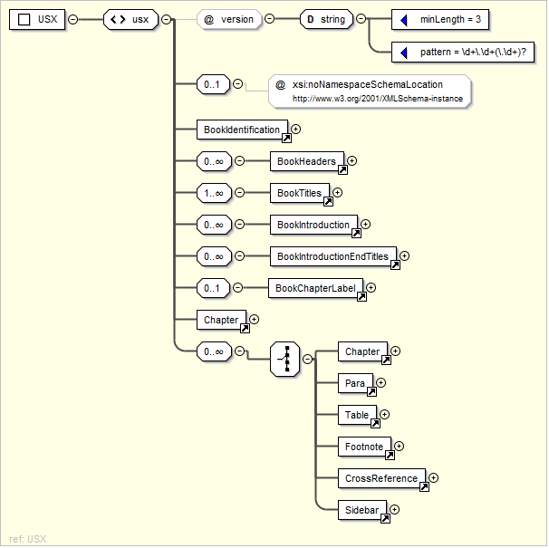
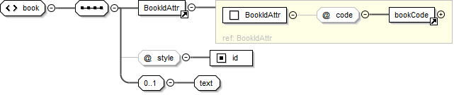
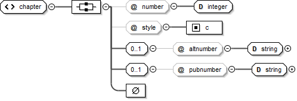
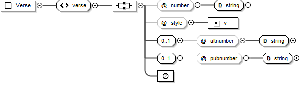
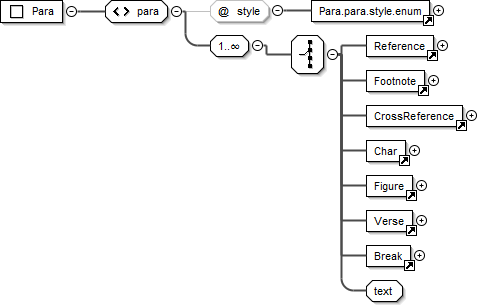
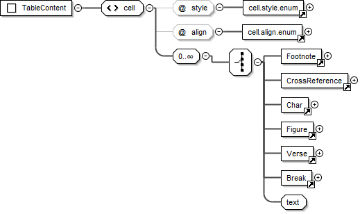
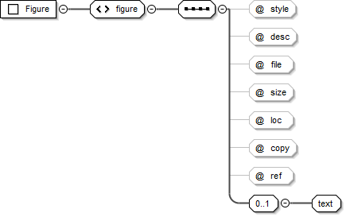

.. include:: /_static/inc_styles.txt

.. _usx_elementIndex:

Elements
========

.. contents:: :depth: 2

.. index:: usx <usx>
.. _usx-element_root:

<usx>
-----

:Element: usx |req| |br|
    *empty*
:Added: 1.0
:Use: Root element for USX scripture file.
:@version: USX version identifier. |req| |br|
	xsd:decimal |br|
	Only the specific USX version number for scripture data contained in the file is allowed (1.0, 2.0, 2.5 etc.).
:Parent: **ROOT**

The following schema diagram displays the document structure of a USX scripture file.

Diagram
"""""""

Sample
""""""
.. code-block:: xml

    <usx version="2.5">

.. index:: usx <book>
.. _usx-element_book:

<book>
------

:Element: book |req| |br|
    xsd:string
:Added: 1.0
:Use: Brief description of scripure translation.
:@code: 3-letter book code for the scripture content in the USX document. |req| |br|
	one of :ref:`bookCode <usx-vocab-bookCode>`
:@style: Content type. |req| |br|
	``id``
:Valid in: :ref:`usx-div_bookIdentification`
:Parent: :ref:`usx-element_root`

Diagram
"""""""

Sample
""""""
.. code-block:: xml

	<book code="MAT" style="id">English: Good News Translation 2nd Ed. 1992</book>

.. index:: usx <chapter>
.. _usx-element_chapter:

<chapter>
---------

:Element: chapter |req| |br|
    *empty*
:Added: 1.0
:Use: Initial element within each chapter text division. Marks the start of a new chapter.
:@style: Content type. |req| |br|
	``c``
:@number: Current chapter number (sequential; according to versification definition for the scripture text). |req| |br|
	xsd:integer
:@altnumber: Alternate chapter number. (Used to supply the chapter number for an alternate versification scheme. This is required when the numbering for an alternate versification tradition need to be maintained within the same translation text.) |br|
	xsd:string of pattern ``[0-9]+\w?(\u200F?[\-,][0-9]+\w?)*``
:@pubnumber: Published chapter character. (The chapter character(s) (a string - number, letter or both) which should be displayed in a published version of the scripture text, where the published chapter character is different than the sequential chapter number used within the translation editing environment, as defined by the project versification.) |req| |br|
	xsd:string
:Valid in: :ref:`usx-div_chapterText`
:Parent: :ref:`usx-element_root`

Diagram
"""""""

Sample
""""""
Code examples for chapter and verse are provided after the definition for element :ref:`verse<usx-element_verse>` (below).

.. index:: usx <verse>
.. _usx-element_verse:

<verse>
-------

:Element: verse |req| |br|
    *empty*
:Added: 1.0
:Use: Marks the start of a new verse.
:@style: Content type. |req| |br|
   ``v``
:@number: Current verse number (sequential; according to versification definition for the scripture text). |req| |br|
	xsd:string of pattern ``[0-9]+\w?(‏?[\-,][0-9]+\w?)*``
:@altnumber: Alternate verse number. (Used to supply the verse number for an alternate versification scheme. This is required when the numbering for an alternate versification tradition need to be maintained within the same translation text.) |br|
	xsd:string of pattern ``[0-9]+\w?(‏?[\-,][0-9]+\w?)*``
:@pubnumber: Published chapter character. (The chapter character(s) (a string - number, letter or both) which should be displayed in a published version of the scripture text, where the published chapter character is different than the sequential chapter number used within the translation editing environment, as defined by the project versification.) |br|
	xsd:string
:Valid in: :ref:`usx-div_chapterText`
:Parents: :ref:`usx-element_para`, :ref:`usx-element_row`, :ref:`usx-element_cell`

Diagram
"""""""

Samples
"""""""
**chapter and verse (MAT 5:1, with preceding and following context)**

.. code-block:: xml

	<para style="p"> ... Large crowds followed him from Galilee and the Ten Towns, from Jerusalem, Judea,
	  and the land on the other side of the Jordan.</para>
	<chapter number="5" style="c" />
	<para style="s">The Sermon on the Mount</para>
	<para style="p">
	  <verse number="1" style="v" />Jesus saw the crowds and went up a hill, where he sat down.
	  His disciples gathered around him, <verse number="2" style="v" />and he began to teach them:</para>
	  ...

An additional six chapters appear interspersed in Esther in the Septuagint. There are 3 common approaches to handling the Greek additions (and many additional variations!). Although Paratext requires sequential chapter and verse numbers to be used within the translation editing environment – as defined by the project versification – in numerous places this is not the string to be published for the chapter and/or verse identifiers at these locations. Examples from Esther Greek are shown below to highlight the application of the @pubnumber attribute for :ref:`chapter <usx-element_chapter>` and :ref:`verse <usx-element_verse>`.

The following example of the text for Esther Greek chapter 1 is taken from the English Good News Bible text. This text follows a versification scheme for Esther Greek which may be referred to as "modern scholars" configuration. Some versions following this scheme include English Good News, French La Bible en francais courant, and German Gute Nachricht Bible.

* In the first portion of this example, you can see a chapter element with the sequential @number "1" which includes a @pubnumber "A". *The "A" should be presented to the reader*.
* In the second portion of this example, a para element with @style "cp" is found. Although a sequential chapter element is not present at this location, *a chapter heading or other appropriate chapter style showing "1" should be presented to the reader*.
* In the second portion of this example you can also see verse elements with sequential @number "18-19", "20", "21", "22". *The corresponding @pubnumber "1-2", "3", "4", and "5" should be presented to the reader*.

**chapter and verse (ESG 1, showing chapter, @pubnumber A, and cp 1; verse 18-19 @pubnumber 1-2 etc.)**

.. code-block:: xml

	<chapter number="1" style="c" pubnumber="A" />
	<para style="s">Mordecai's Strange Dream</para>
	<para style="p">
	<verse number="1-3" style="v" />Mordecai, a Jew who belonged to the tribe of Benjamin, was taken 
	  into exile, along with King Jehoiachin of Judah, when King Nebuchadnezzar of Babylonia captured 
	  Jerusalem...</para>
	
	...

	<para style="cp">1</para>
	<para style="s">Queen Vashti Defies King Xerxes</para>
	<para style="p">
	<verse number="18-19" style="v" pubnumber="1-2" />These things happened in the time of King Xerxes,
	  who ruled 127 provinces, all the way from India to Ethiopia, from his royal throne in Susa, 
	  Persia's capital city. <verse number="20" style="v" pubnumber="3" />In the third year of his reign, 
	  the king gave a banquet for all his advisers, the representatives of the other countries, the 
	  noblemen from Persia and Media, and the governors of the provinces.
	<verse number="21" style="v" pubnumber="4" />For six whole months he made a show of the riches 
	  of the imperial court with magnificent and expensive celebrations.</para>
	<para style="p">
	<verse number="22" style="v" pubnumber="5" />After the feast the king gave a banquet for the people 
	  of other nations who were in the city...</para>
	
	...

The following example is taken from the English Contemporary English Version (CEV) text, which applies a different versification scheme to Esther Greek following the Vulgate. The NRSV Anglicised Edition is another example following this scheme. 

**chapter and verse (ESG 1, showing chapter 1 @pubnumber 11, cp 12, and 1; verse 1-3 @pubnumber 2-4, verse 4 @pubnumber 5, verse 12 @pubnumber 1 etc.)**

.. code-block:: xml
	
	<chapter number="1" style="c" pubnumber="11" />
	<para style="ms1">Addition A</para>
	<para style="s1">Mordecai's Dream</para>
	<para style="p">
	<verse number="1-3" style="v" pubnumber="2-4" />Mordecai son of Jair was a Jew from the Benjamin 
	  tribe, and he lived in the city of Susa in Persia. Mordecai had been taken away from Jerusalem as 
	  a prisoner, when King Nebuchadnezzar of Babylonia had captured King Jehoiachin. ...</para>
	<para style="p">In Mordecai's dream, <verse number="4" style="v" pubnumber="5" /> there was confusion 
	  and unrest all over the world. He heard crashing thunder, and the earth shook with an earthquake
	<verse number="5" style="v" pubnumber="6" /> as two huge dragons went toward each other, ready 
	  to fight...</para>

	...

	<verse number="11" style="v" pubnumber="12" /> Mordecai woke up, but he knew that in his dream he 
	  had seen what God was planning to do. And so, Mordecai thought about his dream all day, trying to 
	  understand exactly what it meant.</para>
	<para style="cp">12</para>
	<para style="s1">Mordecai <optbreak /> Saves the King's Life</para>
	<para style="p">
	<verse number="12" style="v" pubnumber="1" />That night, Mordecai was in the palace courtyard. 
	  He was resting not far from Gabatha and Tharra, the two officers who were on guard duty. 
	<verse number="13" style="v" pubnumber="2" /> Mordecai overheard them talking, and as he 
	  listened carefully, he realized they were planning to murder King Artaxerxes.</para>
	
	...

	<para style="ms1">End of Addition A</para>
	<para style="cp">1</para>
	<para style="s1">Queen Vashti Disobeys <optbreak /> King Artaxerxes</para>
	<para style="p">
	<verse number="18-20" style="v" pubnumber="1-3" />King Artaxerxes lived in his capital city of Susa
	  and ruled 127 provinces from India to Ethiopia.</para>

An example from Psalms (modified French TOB) showing an alternate chapter and verse numbering scheme encoded within the text.

**chapter and verse (PSA 42, showing chapter @altnumber and verse @altnumber)**

.. code-block:: xml

	<chapter number="42" style="c" altnumber="41" />
	<para style="ms1">DEUXIÈME LIVRE</para>
	<para style="mr">(Ps 42–72)</para>
	<para style="s1">PSAUME 42</para>
	<para style="d">
	<char style="va">1</char> Du chef de chœur. Instruction des fils de Coré.</para>
	<para style="q1">
	<verse number="1" style="v" altnumber="2" /> Comme une biche se tourne</para>
	<para style="q1">vers les cours d'eau,</para>
	<para style="q1">ainsi mon âme se tourne</para>
	<para style="q1">vers toi, mon Dieu.</para>
	<para style="q1">
	<verse number="2" style="v" altnumber="3" /> J'ai soif de Dieu,</para>
	<para style="q1">du Dieu vivant:</para>
	<para style="q1">Quand pourrai-je entrer</para>
	<para style="q1">et paraître face à Dieu?</para>

.. index:: usx <para>
.. _usx-element_para:

<para>
------
|ico_R| Schema pattern name: **Para**

:Element: para |br|
	xsd:string
:Added: 1.0
:Use: Paragraph content.
:@style: Content type. |req| |br|
	Permitted values vary for each document division. The :doc:`para @style types <parastyles>` list presents an itemization of style values by category (paragraphs, poetry, titles etc.) and indicates the :doc:`document divisions <structure>` in which each type is valid.
:Valid in: :ref:`usx-div_bookHeader`, :ref:`usx-div_bookTitles`, :ref:`usx-div_bookIntroduction`, :ref:`usx-div_introductionEndTitles`, :ref:`usx-div_bookChapterLabel`, :ref:`usx-div_chapterText`
:Parents: :ref:`usx-element_root`

Diagram
"""""""

Sample
""""""
.. code-block:: xml

	<para style="p">
	<verse number="1" style="v" />This is the Good News about Jesus Christ, the Son of God ...</para>

	<para style="q1">“God said, ‘I will send my messenger ahead of you</para>
	<para style="q2">to open the way for you.’</para>

	<para style="s">The Sermon on the Mount</para>
	<para style="p">
	  <verse number="1" style="v" />Jesus saw the crowds and went up a hill, where he sat down.
	  His disciples gathered around him, <verse number="2" style="v" />and he began to teach them:</para>
	<para style="s">Salt and Light</para>
	<para style="r">(Mark 9.50; Luke 14.34,35)</para>
	<para style="p">
	  <verse number="13" style="v" />“You are like salt for the whole human race...</para>

.. index:: usx <table>
.. _usx-element_table:

<table>
-------
|ico_R| Schema pattern name: **Table**

:Element: table |br|
	*empty*
:Added: 1.0
:Use: Contains :ref:`usx-element_row` and :ref:`usx-element_cell` child elements which compose the structure of a USX :ref:`usx-element_table`. Tables are composed of a vertical sequence of one or more rows. Rows are composed of a horizontal sequence of one of more cells.
:Valid in: :ref:`usx-div_bookIntroduction`, :ref:`usx-div_chapterText`
:Parents: :ref:`usx-element_root`

Diagram
"""""""

.. index:: usx <row>
.. _usx-element_row:

<row>
-----

:Element: row (|req| within :ref:`usx-element_table`) |br|
	*empty*
:Added: 1.0
:Use: Contains a horizontal sequence of table :ref:`usx-element_cell` elements. The horizontal position of a table cell relates to its corresponding table column.
:Valid in: Any valid :ref:`usx-element_table`
:Parents: :ref:`usx-element_table`

.. index:: usx <cell>
.. _usx-element_cell:

<cell>
------
|Ico_R| Schema pattern name: **TableContent**

:Element: cell (|req| within usx-element_row) |br|
	xsd:string
:Added: 1.0
:Use: Table cell content. Contains the cell text and and child elements.
:@style: Cell column and alignment (legacy). |req| |br|
	``th#`` | ``thr#`` | ``tc#`` | ``tcr#`` |br|
	The variable represents the table column number. *See "About cell @style" note below.*
:@align: Cell alignment. |req| |br|
	``start`` | ``center`` | ``end`` |br|
	Represents “left”, “center”, and “right” respectively in left-to-right direction texts, and “right”, “center”, “left” in right-to-left direction texts.
:Valid in: Any valid :ref:`usx-element_row`
:Parents: :ref:`usx-element_row`

.. note::

	Like the @style attribute applied to other USX elements, the cell @style value is a reference to the source text USFM marker in Paratext, from which USX encoded text is often derived. In USFM text, the table cell markers define the column to which they belong. The variable # represents the table column number. Strictly speaking @style is redundant information in USX. It is used by Paratext for round-tripping USX to USFM. In USX, the position of a :ref:`usx-element_cell` in its sequence defines its respective column, and the @align attribute is the primary source of cell alignment information.

Diagram
"""""""

Sample
""""""

**NUM 2:3-9**

.. code-block:: xml

	<table>
	  <row style="tr">
	    <cell style="th1" align="start">Tribe </cell>
	    <cell style="th2" align="start">Leader </cell>
	    <cell style="th3" align="start">Number</cell>
	  </row>
	  <row style="tr">
	    <cell style="tc1" align="start">Judah </cell>
	    <cell style="tc2" align="start">Nahshon son of Amminadab </cell>
	    <cell style="tcr3" align="end">74,600</cell>
	  </row>
	  <row style="tr">
	    <cell style="tc1" align="start">Issachar </cell>
	    <cell style="tc2" align="start">Nethanel son of Zuar </cell>
	    <cell style="tcr3" align="end">54,400</cell>
	  </row>
	  <row style="tr">
	    <cell style="tc1" align="start">Zebulun </cell>
	    <cell style="tc2" align="start">Eliab son of Helon </cell>
	    <cell style="tcr3" align="end">57,400</cell>
	  </row>
	  <row style="tr">
	    <cell style="tc1" align="start" />
	    <cell style="tc2" align="end">Total: </cell>
	    <cell style="tcr3" align="end">186,400</cell>
	  </row>
	</table>

.. index:: usx <char>
.. _usx-element_char:

<char>
------

|ico_R| Schema pattern name: **Char**

:Element: char |br|
	xsd:string
:Added: 1.0
:Use: An element for marking character level content types within :ref:`para <usx-element_para>`, table :ref:`cell <usx-element_cell>` and :ref:`note <usx-element_note>` elements.
:@style: Content type. |req| |br|
	Permitted values vary for each document division. The :doc:`char @style types <charstyles>` list presents an itemization of style values by category and indicates the :doc:`document divisions <structure>` in which each type is valid.
:Valid in: :ref:`usx-div_bookTitles`, :ref:`usx-div_bookIntroduction`, :ref:`usx-div_introductionEndTitles`, :ref:`usx-div_bookChapterLabel`, :ref:`usx-div_chapterText` |br|
	A limited subset of @style types are valid within :ref:`note <usx-element_note>` (Footnote, CrossReference)
:Parents: :ref:`usx-element_para`, :ref:`usx-element_cell`, :ref:`usx-element_note`

Diagram
"""""""

.. image:: images/usx-element_char.png

Sample
""""""
.. code-block:: xml
	
	<para style="ip">The name <char style="bk">Genesis</char> means “origin.”
 
	Then the <char style="nd">Lord</char> God took some soil from the ground and formed a man

	<para style="p">
	  <verse number="1" style="v" />This is the Good News about Jesus Christ, the Son of God.
	  It began as the prophet Isaiah had written:</para>
	<para style="q1">
	  <char style="qt">“God said, ‘I will send my messenger ahead of you</char></para>
	<para style="q2">
	  <char style="qt">to open the way for you.’</char></para>
	...

.. index:: usx <note>
.. _usx-element_note:

<note>
------

The USX note element is used to contain the content for any :ref:`footnotes <usx-note_footnote>` or :ref:`cross references <usx-note_crossReference>` content. Different note *types* are distinguished by the note **@style** attribute. The content for each note type is marked using :ref:`usx-element_char` with a specific subset of @style types for the chosen note type. To help make things clear in this document, the markup for :ref:`footnotes <usx-note_footnote>` and :ref:`cross references <usx-note_crossReference>` are described in separate sections because they use different char @style types within them.

|Ico_See| **See:** :doc:`<note> Types <notes>`

.. index:: usx <sidebar>
.. _usx-element_sidebar:

<sidebar>
---------
|Ico_R| Schema pattern name: **Sidebar**

:Element: sidebar |br|
	*empty*
:Added: 2.0
:Use: Contains :ref:`usx-element_para` (@style types :ref:`usx-parastyles_titles_headings`, :ref:`usx-parastyles_paragraphs`, :ref:`usx-parastyles_poetry`), :ref:`usx-element_table` and :ref:`usx-element_char` elements to contain the content for a sidebar. Sidebars are larger sections of topical content, or information for more in-depth study. This content is associated with a general area in the scripture reference text, but not necessarily a specific verse or word.
:@style: Content type |req| |br|
	``esb``
:@category: Optional attribute used to tag the :ref:`usx-element_sidebar` as belonging to a specific category of study content (e.g. Ideas, People, Places, Objects etc.).
:Valid in: :ref:`usx-div_bookIntroduction`, :ref:`usx-div_chapterText`
:Parents: :ref:`usx-element_root`

Diagram
"""""""

.. image:: images/usx-pattern_Sidebar.png

Samples
"""""""
**Matthew 2**

.. code-block:: xml

	  <sidebar style="esb" category="Ideas">
	  	<para style="ms">Dates in B.C. and A.D.</para>
	  	<para style="p">The initials <char style="sc">b.c.</char> have traditionally been 
	  		an abbreviation for “Before Christ.” If <char style="bk">Luke</char>'s dating 
	  		is correct, then Jesus was born at least four years before the years known as 
	  		<char style="sc">a.d.</char> began. (<char style="sc">a.d.</char> stands for the 
	  		Latin phrase “in the year of our Lord”). Christian dating was actually not 
	  		introduced until <char style="sc">a.d.</char> 526 by a monk named Dionysius 
	  		Exiguus. He was given the job of creating a calendar for the feasts of the church. 
	  		He fixed the birth of Jesus in the Roman year 754, which was selected as the first 
	  		year of the Christian era beginning on January 1. Dionysius apparently misjudged 
	  		Herod's reign by about five years.
	  	</para>
	  	<para style="p">The initials <char style="sc">b.c.e.</char> (Before the Common Era) 
	  		and <char style="sc">c.e.</char> (in the Common Era) are sometimes used for the 
	  		traditional <char style="sc">b.c.</char> and <char style="sc">a.d.</char>
	  	</para>
	  </sidebar>

**Galatians 3**

.. code-block:: xml

	  <sidebar style="esb" category="People">
	  	<para style="ms">Abraham</para>
	  	<para style="p">The list of the descendants of Noah's sons comes to an end 
	  		(<char style="xt"><ref loc="GEN 11:26">Gen 11.26</ref></char>) with Abram 
	  		(“exalted father”). He later became known as Abraham (“father of many”). 
	  		God told Abram (<char style="xt"><ref loc="GEN 12:1-3">Gen 12.1-3</ref></char>) 
	  		to move from his home in Ur of the Chaldees (in southern Mesopotamia) to the land 
	  		of Canaan. God promised that his family would become “a great nation” with a special 
	  		relationship to God. And all nations would be blessed because of Abraham and his wife
	  		Sarah and their descendants (<char style="xt"><ref loc="GEN 12:1-3">Gen 12.1-3</ref>; 
	  		<ref loc="GEN 15:1-21">15.1-21</ref></char>). So Abraham went with Sarah and his 
	  		nephew Lot.
	  		...
	  	</para>
	  </sidebar>

.. index:: usx <figure>
.. _usx-element_figure:

<figure>
--------
|Ico_R| Schema pattern name: **Figure**

:Element: figure |br|
	xsd:string
:Added: 1.0
:Use: Definition for an illustration which could be formatted at or near to this location in a publication. |br|
	The element's text content is the caption for the illustration. |br|
	xsd:string
:@style: Content type. |req| |br|
	``fig``
:@desc: Illustration description. This text is not normally rendered within a publication. |req| |br|
	xsd:string | *empty*
:@file: Illustration filename or URI. |req| |br|
	xsd:string | *empty*
:@size: Illustration relative size. |req| |br|
	``col`` | ``span`` | <user defined> xsd:string | *empty* |br|
	**col** - Illustration should be inserted inline within the space for the current text column. |br|
	**span** - Illustration should be inserted across (spanning) all text columns (i.e. the maximum available page or screen width).
:@loc: Illustration location/range. |req| |br|
	xsd:string | *empty*
:@copy: Copyright information. |req| |br|
	xsd:string | *empty*
:@ref: Illustration reference. This text will commonly be rendered together with the illustration caption. |req|
	xsd:string | *empty*
:Valid in: :ref:`usx-div_bookIntroduction`, :ref:`usx-div_chapterText`
:Parents: :ref:`usx-element_root`

Diagram
"""""""

Sample
""""""
.. code-block:: xml

	<figure style="fig" desc="" file="avnt016.jpg" size="span" loc="" copy="" ref="1.18">
		At once they left their nets.</figure>

.. index:: usx <optbreak>
.. _usx-element_optbreak:

<optbreak>
----------

:Element: optbreak |br|
	*empty*
:Added: 2.0
:Use: Discretionary (optional) line break location. |br|
	Primarily used in :ref:`poetic <usx-parastyles_poetry>` text, but could also be used for marking optional breaks for :ref:`titles <usx-parastyles_titles_headings>`, :ref:`headings <usx-parastyles_titles_headings>`, or table :ref:`usx-element_cell` content.
:Valid in: :ref:`usx-div_bookTitles`, :ref:`usx-div_bookIntroduction`, :ref:`usx-div_introductionEndTitles`, :ref:`usx-div_bookChapterLabel`, :ref:`usx-div_chapterText`
:Parents: :ref:`usx-element_para`, :ref:`usx-element_cell`

Sample
""""""
.. code-block:: xml

	<para style="s1">Jesus Heals a Man <optbreak /> Who Could Not Walk</para>

.. index:: usx <ref>
.. _usx-element_ref:

<ref>
-----

:Element: ref
:Added: 2.0
:Use: Scripture reference. |br|
	When :ref:`usx-element_ref` is used with a USX encoded text, each segment of a scripture reference should be wrapped in a :ref:`usx-element_ref` element. |br|
	xsd:string
:@loc: A parsable (machine-readable) representation of the vernacular text for the scripture reference. Book names must be one of :ref:`bookCode <usx-vocab-bookCode>`. Chapter verse separator is always a colon (:).
:Valid in: 
:Parents: 

Diagram
"""""""

.. image:: images/usx-element_ref.png

Sample
""""""

.. code-block:: xml

	<ref loc="MAT 3:1-4">Mt 3.1-4</ref>,<ref loc="MAT 3:7-13">7-13</ref>
	<ref loc="MAT 3:4-4:5">Mt 3.4—4.5</ref>
	<ref loc="LUK 3-5">Lk 3—5</ref>
	<ref loc="MAT-LUK">Mt—Lk</ref>
	<ref loc="MAT 3:4-5:6">Matthew 3.4—5.6</ref>; <ref loc="LUK 7">Luke 7</ref>

Sample Details
""""""""""""""
Example:

.. code-block:: xml

	<char style="xt">Mt 3.4-5</char>

becomes:

.. code-block:: xml

	<char style="xt"><ref loc="MAT 3:4-3:5">Mt 3.4-5</ref></char>

**Comma-delimited verses and chapters are split up as much as possible:**

Example:

.. code-block:: xml

	Mt 3.4-5,6

becomes:

.. code-block:: xml

	<ref loc="MAT 3:4-3:5">Mt 3.4-5</ref>,<ref loc="MAT 3:6">6</ref>

Example:

.. code-block:: xml

	Mt 3.4-5.7

becomes:

.. code-block:: xml

	<ref loc="MAT 3:4-5:7">Mt 3.4-5.7</ref>

**Chapter ranges are acceptable:**

Example:

.. code-block:: xml

	Mt 3-5

becomes:

.. code-block:: xml

	<ref loc="MAT 3-5">Mt 3-5</ref>

**Book ranges are encoded as first reference only:**

Example:

.. code-block:: xml

	Mt-Lk

becomes:

.. code-block:: xml

	<ref loc="MAT">Mt-Lk</ref>
