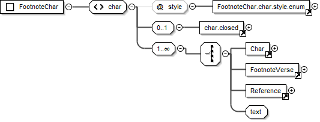

.. include:: /_static/inc_styles.txt

.. index:: element; <note>
.. _usx-note:

<note> Types
============

.. index:: element; <note> (footnote), footnote; <note> element
.. index:: element; <note> (endnote), endnote; <note> element
.. index:: element; <note> (study note), study note; <note> element
.. index:: attribute; note@style (footnote), attribute; note@style (endnote), attribute; note@style (study footnote)
.. index:: study bible; footnote
.. _usx-note_footnote:

Footnote <note>
---------------

:Element: note |br|
	*empty* (all content is contained within the note's child char elements)
:Added: 1.0
:Use: Contains child :ref:`usx-element_char` elements to contain the content for a footnote, endnote, or study note.
:@caller: Note caller. |req| |br|
	``+`` | ``-`` | <user defined caller> |br|
	*A <user defined caller> may be any single character or sequence of characters preferred as the caller for a note.*
:@style: Content (footnote) type. |req| |br|
	``f`` (footnote) | ``fe`` (endnote) | ``ef`` (extended / study note)
:@category: Optional attribute used to tag the :ref:`usx-note_footnote` as belonging to a specific category of study content (e.g. Ideas, People, Places, Objects etc.). The @category attribute is normally only applied to :ref:`usx-element_note` @style="ef". 
:Valid in: :ref:`usx-div_bookTitles`, :ref:`usx-div_bookIntroduction`, :ref:`usx-div_bookIntroductionEndTitles`, :ref:`usx-div_chapterContent`
:Parents: :ref:`usx-element_para`, :ref:`usx-element_char`, :ref:`usx-element_cell`

**Diagram**

.. image:: images/usx-element_notef.png

.. index:: element; <char> (footnote), footnote; <char> element
.. index:: element; <char> (endnote), endnote; <char> element
.. index:: element; <char> (study note), study note; <char> element
.. _usx-note_footnote_char:

Footnote <char>
"""""""""""""""

:Element: char |br|
	xsd:string
:Added: 1.0
:Use: An element for marking various footnote content types.
:@style: Footnote content type. |req| |br|
	The :ref:`usx-element_char` (Footnote) @style types list (below) presents an itemization of @style values valid within :ref:`usx-element_char` elements which are children of :ref:`usx-element_note` @style="f", :ref:`usx-element_note` @style="fe", and :ref:`usx-element_note` @style="ef".
:Valid in: :ref:`usx-note_footnote`

**Diagram**

.. index:: footnote; char@style
.. index:: attribute; char@style (footnote)
.. _usx-note_footnote_charstyles:

Footnote <char> @style Types
""""""""""""""""""""""""""""

.. index:: char@style (footnote); fr, footnote; origin reference
.. _usx-note_footnote_charstyle_fr:

fr
^^

:@style: fr
:Use: Footnote "origin" reference. |br|
	This is the chapter and verse(s) that note refers to.
:Valid In: Any :ref:`usx-note_footnote_char`

**Text and Formatting Sample** - Mark 1.1 (GNT)

.. code-block:: xml
	:name: usx-charstyle_fr_example
	:emphasize-lines: 2

	<note caller="+" style="f">
	  <char style="fr">1.1: </char>
	  <char style="ft">Some manuscripts do not have </char>
	  <char style="fq">the Son of God.</char>
	</note>

-----

.. index:: char@style (footnote); ft, footnote; footnote text
.. _usx-note_footnote_charstyle_ft:

ft
^^

:@style: ft
:Use: Footnote text |br|
	The primary (explanatory) text of the footnote.
:Valid In: Any :ref:`usx-note_footnote_char`

-----

.. index:: char@style (footnote); fk, footnote; keyword
.. _usx-note_footnote_charstyle_fk:

fk
^^

:@style: fk
:Use: A specific keyword/term from the text for which the footnote is being provided.
:Valid In: Any :ref:`usx-note_footnote_char`

**Text and Formatting Sample** - Genesis 3.20 (GNT)

.. code-block:: xml
	:name: usx-charstyle_fk_example
	:emphasize-lines: 3

	<note caller="+" style="f">
	  <char style="fr">3.20: </char>
	  <char style="fk">Adam </char>
	  <char style="ft">This name in Hebrew means "all human beings."</char>
	</note>	

.. image:: images/usx-notechar-style_fk.jpg
	:width: 450px

-----

.. index:: char@style (footnote); fq, footnote; translation quotation
.. _usx-note_footnote_charstyle_fq:

fq
^^

:@style: Footnote translation quotation.
:Use: A quotation from the current scripture text translation for which the note is being provided. |br|
	Longer quotations are sometimes shortened using an ellipsis (i.e. suspension dots "...").
:Valid In: Any :ref:`usx-note_footnote_char`

**Text and Formatting Sample** - Mark 1.1 (GNT)

.. code-block:: xml
	:name: usx-charstyle_fq_example
	:emphasize-lines: 4

	<note caller="+" style="f">
	  <char style="fr">1.1: </char>
	  <char style="ft">Some manuscripts do not have </char>
	  <char style="fq">the Son of God.</char>
	</note>

.. image:: images/usx-notechar-style_fq.jpg
	:width: 450px

-----

.. index:: char@style (footnote); fqa, footnote; alternate translation
.. _usx-note_footnote_charstyle_fqa:

fqa
^^^

:@style: fqa
:Use: Footnote alternate translation. |br|
	Used to distinguish between a quotation of the current scripture text translation, and an alternate translation.
:Valid In: Any :ref:`usx-note_footnote_char`

**Text and Formatting Sample** - Mark 1.4 (GNT)

.. code-block:: xml
	:name: usx-charstyle_fqa_example
	:emphasize-lines: 5

	<note caller="+" style="f">
	  <char style="fr">1.4: </char>
	  <char style="fq">John appeared in the desert, baptizing and preaching; </char>
	  <char style="ft">some manuscripts have </char>
	  <char style="fqa">John the Baptist appeared in the desert, preaching.</char>
	</note>

.. image:: images/usx-notechar-style_fqa.jpg
	:width: 450px

-----

.. index:: char@style (footnote); fl, footnote; label text
.. _usx-note_footnote_charstyle_fl:

fl
^^

:@style: fl
:Use: Footnote "label" text. |br|
	Can be used for marking or "labeling" a word or words which are used consistently across certain types of translation notes (such as the words "Or" in an alternative translation style note, "Others", "Heb.", "LXX" etc.).
:Valid In: Any :ref:`usx-note_footnote_char`

-----

.. index:: char@style (footnote); fw, footnote; witness list
.. _usx-note_footnote_charstyle_fw:

fw
^^

|badge_3.0|

:@style: fw
:Added: 3.0
:Use: Footnote witness list. |br|
	For distinguishing a list of sigla representing witnesses in critical editions.
:Valid In: Any :ref:`usx-note_footnote_char`

.. note::

	Apparatus entries of printed critical editions are densely packed with information. One key part is the list of witnesses supporting a specific reading. The witnesses are usually represented by sigla consisting of one character, an abbreviation, or a number. It can be very helpful to distinguish witness lists from other footnote text, which can make it simpler to introduce checking tools for these lists, and to create linking and reader helps in digital representations.

**Text and Formatting Samples** - Matthew 28.14 (Nestle-Aland 29)

.. code-block:: xml
	:name: usx-charstyle_fw_example
	:emphasize-lines: 3

	<note caller="⸀" style="f">
		<char style="fr" closed="false">28,14 </char><char style="ft" closed="false">υπο </char>
		<char style="fw" closed="false">B D 0148. 892</char>
	</note>

.. image:: images/usx-notechar-style_fw.jpg
	:width: 450px

Matthew 4.1 (Nestle-Aland 29)

.. code-block:: xml
	:name: usx-charstyle_fw_example-alt
	:emphasize-lines: 2

	<note caller="°" style="f">
		<char style="fr" closed="false">4,1 </char><char style="fw" closed="false">B Δ 700</char>
	</note>

.. image:: images/usx-notechar-style_fw-alt.jpg
	:width: 450px

-----

.. index:: char@style (footnote); fp, footnote; additional paragraph
.. _usx-note_footnote_charstyle_fp:

fp
^^

:@style: fp
:Use: Footnote additional paragraph. |br|
	Use this marker to if you need to indicate the start of a new paragraph within a footnote (uncommon).
:Valid In: Any :ref:`usx-note_footnote_char`

-----

.. index:: char@style (footnote); fv, footnote; verse number
.. _usx-note_footnote_charstyle_fv:

fv
^^

:@style: fv
:Use: Footnote verse number. |br|
	A verse number in the the text quotation or alternative translation.
:Valid In: Any :ref:`usx-note_footnote_char`

**Text and Formatting Sample** - John 7.38 (GNT)

.. code-block:: xml
	:name: usx-charstyle_fv_example
	:emphasize-lines: 5

	<note caller="+" style="f">
	  <char style="fr">7.38: </char>
	  <char style="ft">Jesus' words in verses 37-38 may be translated: </char>
	  <char style="fqa">“Whoever is thirsty should come to me and drink. </char>
	  <char style="fv">38</char> As the scripture says, ‘Streams of life-giving water  
	  will pour out from within anyone who believes in me.’”
	</note>

.. image:: images/usx-notechar-style_fv.jpg
	:width: 500px

-----

.. index:: char@style (footnote); fdc, footnote; deuterocanonical content
.. _usx-note_footnote_charstyle_fdc:

fdc
^^^

:@style: fdc
:Deprecated: |badge_3.0| 3.0
:Use: Material to be included only in publications that contain the Deuterocanonical/Apocrypha books. |br|
	**Deprecated** (use is discouraged) |br| |br|
	|ico_Cg| *Recommended alternate:* General purpose use of <char> @style :ref:`dc <usx-charstyle_dc>` wherever DC-only content is being marked.
:Valid In: Any :ref:`usx-note_footnote_char`

.. note::

	Other :ref:`usx-element_char` :doc:`@style types <charstyles>` may be nested within any of the standard footnote :ref:`usx-element_char` :ref:`@style types <usx-note_footnote_charstyles>` shown in the list above.

-----

.. index:: element; <note> (cross reference), cross reference; <note> element
.. index:: element; <note> (study cross reference), study cross reference; <note> element
.. index:: attribute; note@style (cross reference), attribute; note@style (study cross reference)
.. index:: study bible; cross reference
.. _usx-note_crossReference:

Cross Reference <note>
----------------------

:Element: note |br|
	*empty* (all content is contained within the note's child char elements)
:Added: 1.0
:Use: Contains child :ref:`usx-element_char` elements to contain the content for a cross reference or study cross reference.
:@caller: Cross reference caller. |req| |br|
	``+`` | ``-`` | <user defined caller> |br|
	*A <user defined caller> may be any single character or sequence of characters preferred as the caller for a note.*
:@style: Content (cross reference) type. |req| |br|
	``x`` (cross reference) | ``ex`` (extended / study cross reference)
:Valid in: :ref:`usx-div_bookTitles`, :ref:`usx-div_bookIntroduction`, :ref:`usx-div_bookIntroductionEndTitles`, :ref:`usx-div_chapterContent`
:Parents: :ref:`usx-element_para`, :ref:`usx-element_char`, :ref:`usx-element_cell`

**Diagram**

.. image:: images/usx-element_notex.png

.. index:: element; <char> (cross reference), cross reference; <char> element
.. index:: element; <char> (study cross reference), study cross reference; <char> element
.. _usx-note_crossReference_char:

Cross Reference <char>
""""""""""""""""""""""

:Element: char |br|
	xsd:string
:Added: 1.0
:Use: An element for marking various cross reference content types.
:@style: Cross reference content type. |req| |br|
	The :ref:`usx-element_char` (Cross Reference) @style types list (below) presents an itemization of @style values valid within :ref:`usx-element_char` elements which are children of :ref:`usx-element_note` @style="x".
:Valid in: :ref:`usx-note_crossReference`

**Diagram**

.. image:: images/usx-element_charx.png

.. index:: cross reference; char@style
.. index:: attribute; char@style (cross reference)
.. _usx-note_crossReference_charstyles:

Cross Reference <char> @style Types
"""""""""""""""""""""""""""""""""""

.. index:: char@style (cross reference); xo, cross reference; origin reference
.. _usx-note_crossReference_charstyle_xo:

xo
^^

:@style: xo
:Use: Cross reference origin reference. |br|
	This is the chapter and verse(s) that target (@style="xt") reference(s) are being provided for.
:Valid In: Any :ref:`usx-note_crossReference_char`

**Text and Formatting Sample** - Matthew 2.23 (GNT)

.. code-block:: xml
	:name: usx-charstyle_xo_example
	:emphasize-lines: 2

	<note caller="-" style="x">
	  <char style="xo">2.23: </char>
	  <char style="xt">Mk 1.24; Lk 2.39; Jn 1.45.</char>
	</note>

.. image:: images/usx-notechar-style_xo.jpg
	:width: 500px

-----

.. index:: char@style (cross reference); xop, cross reference; published origin text
.. _usx-note_crossReference_charstyle_xop:

xop
^^^

|badge_3.0|

:@style: xop
:Added: 3.0
:Use: Published cross reference origin text. |br|
	In some texts, the content intended to be published in the position of the cross reference origin text :ref:`xo <usx-note_crossReference_charstyle_xo>` does not follow the typical ``<chapter><separator><verse>`` pattern. An origin reference following this pattern is required for validation of the cross reference location. ``<char @style="xop">...</char>`` can be used in order to supply the content intended for publishing, similar to the use of :ref:`chapter@pubnumber <usx-element_chapter>` and :ref:`verse@pubnumber <usx-element_verse>`.
:Valid In: Any :ref:`usx-note_crossReference_char`

**Text and Formatting Sample** - Jonah 1.1-5 (Bulgarian Orthodox Bible)

.. code-block:: xml
	:name: usx-charstyle_xop_example
	:emphasize-lines: 3,9,15,21

	<note caller="-" style="x">
		<char style="xo">1:1 </char>
		<char style="xop">Гл 1. (1) </char> 
		<char style="xt">4 Царств. 14:25.</char>
	</note>
	...
	<note caller="-" style="x">
		<char style="xo">1:2 </char>
		<char style="xop">(2) </char>
		<char style="xt">Бит. 10:11. Иона 3:3.</char>
	</note>
	...
	<note caller="-" style="x">
		<char style="xo">1:4 </char>
		<char style="xop">(4) </char>
		<char style="xt">Пс. 106:25.</char>
	</note>
	...
	<note caller="-" style="x">
		<char style="xo">1:5 </char>
		<char style="xop">(5) </char>
		<char style="xt">4 Царств. 17:29.</char>
	</note>

.. image:: images/usx-notechar-style_xop.jpg
	:width: 500px

-----

.. index:: char@style (cross reference); xt, cross reference; target reference(s)
.. _usx-note_crossReference_charstyle_xt:

xt
^^

:@style: xt
:Use: Cross reference target reference(s). |br|
	The list of target scripture passages being suggested as references for comparison/review with respect to the text (or concept) of the origin reference. |br|
	A list of book name abbreviations and chapter + verse references, separated by semicolons or other book list separator character.
:Updated: 3.0 (attributes)
:Valid In: Any :ref:`usx-note_crossReference_char`

.. _usx-note_crossReference_charstyle_xt-attr:
.. index:: cross reference; target reference(s) attributes

.. rubric:: Attributes |ico_Tag|

|badge_3.0|

An *additional* :ref:`link-href <usx-charstyle-attr_link-href>` :doc:`attribute <attributes>` for :ref:`<char> <usx-element_char>` can be used in this context, followiung the definitions for :doc:`linking attributes </linking>`.

.. _usx-note_crossReference_charstyle_xt-attr_link-href:
.. index:: attribute; char@link-href (@style="xt")

:@link-href: Citation form for the term in the glossary

:link-href: Unambiguously identifies the scripture target reference using a standard scripture reference format. *(default)* |br|
	Book names must be one of :ref:`bookCode <usx-vocab-bookCode>`. Chapter verse separator is always a colon ``:``. A string of pattern: ``[A-Z1-4]{3} ?[a-z0-9\-,:]*`` |br| |br|
	In some scenarios a target reference is written in a format which cannot be accurately parsed and identified. Providing the ``link-href`` attribute allows greater flexibility in the use of char@style :ref:`xt <usx-note_crossReference_charstyle_xt>`. |br| |br| 
	In this context, ``link-href`` should only target scripture references for the current text (i.e. references to other project texts or non-scripture URIs are not allowed)

**Text Sample** - Genesis 2 (Russian Synodal, Protestant Version, extending the sample for para@style :ref:`cd <usx-parastyle_cd>` - chapter description)

.. code-block:: xml
	:name: usx-parastyle_cd-xt_example
	:emphasize-lines: 2-5

	<chapter number="2" style="c" />
	<para style="cd"><char style="xt" link-href="GEN 2:1">1</char> Бог благословляет седьмой 
	  день; <char style="xt" link-href="GEN 2:8">8</char> человек в раю Едемском; четыре реки; 
	  дерево познания добра и зла. <char style="xt" link-href="GEN 2:18">18</char> Человек дает 
	  названия животным. <char style="xt" link-href="GEN 2:21">21</char> Создание женщины.
	<para style="p">
	  <verse number="1" style="v" sid="GEN 2:1" />Так совершены небо и земля и все воинство их.
	  <verse eid="GEN 2:1" />
	</para>
	<para style="p">
	  <verse number="2" style="v" sid="GEN 2:2" />И совершил Бог к седьмому дню дела Свои, которые 
	  Он делал, и почил в день седьмой от всех дел Своих, которые делал.<verse eid="GEN 2:2" />
	</para>

A number (7) alone marked with ``<char style="xt">7</char>`` is ambiguous, since it could refer to chapter 7 or verse 7 (in `Paratext <https://paratext.org>`_, a number alone is interpreted as a chapter reference). Extending char@style :ref:`xt <usx-note_crossReference_charstyle_xt>` with the ``link-ref`` attribute makes it possible to express the target reference unambiguously.

.. code-block:: xml
	:name: usx-parastyle_cd-xt_example-alt

	<char style="xt" link-href="MAT 6:7">7</char>
	<char style="xt" link-href="MAT 6:7">verse 7</char>
	<char style="xt" link-href="MAT 6:7">v7</char>

-----

.. index:: char@style (cross reference); xta, cross reference; 	target reference(s) extra / added text
.. _usx-note_crossReference_charstyle_xta:

xta
^^^

|badge_3.0|

:@style: xta
:Added: 3.0
:Use: Target reference(s) extra / added text. |br|
	Used for marking text which should be ignored when identifying or linking to cross reference target references.
:Valid: Any :ref:`usx-note_crossReference_char`

**Text Sample** - Matthew 3.0 (GNT)

.. code-block:: xml
	:name: usx-charstyle_xta_example
	:emphasize-lines: 3,5,7

	<note caller="-" style="x">
	  <char style="xo">3.0: </char>
	  <char style="xta">Compare with </char>
	  <char style="xt">Mk 1.1-8; Lk 3.1-18; </char>
	  <char style="xta">and</char>
	  <char style="xt">Jn 1.19-28 </char>
	  <char style="xta">parallel passages.</char>
	</note>

-----

.. index:: char@style (cross reference); xk, cross reference; keyword
.. _usx-note_crossReference_charstyle_xk:

xk
^^

:@style: xk
:Use: A keyword from the scripture translation text which the target reference(s) also refer to.
:Valid In: Any :ref:`usx-note_crossReference_char`

-----

.. index:: char@style (cross reference); xq, cross reference; translation quotation
.. _usx-note_crossReference_charstyle_xq:

xq
^^

:@style: xq
:Use: A quotation from the scripture text. |br|
	*Use of a quotation would be intended to help the reader to understand the portion of text (or concept) for which the target (xt) reference(s) are being supplied.*
:Valid In: Any :ref:`usx-note_crossReference_char`

-----

.. index:: char@style (cross reference); xot, cross reference; old testament content
.. _usx-note_crossReference_charstyle_xot:

xot
^^^

:@style: xot
:Use: References (or other text) which is only to be included in publications that contain the Old Testament books.
:Valid In: Any :ref:`usx-note_crossReference_char`

-----

.. index:: char@style (cross reference); xnt, cross reference; new testament content
.. _usx-note_crossReference_charstyle_xnt:

xnt
^^^

:@style: xnt
:Use: References (or other text) which only to be included in publications that contain the New Testament books.
:Valid In: Any :ref:`usx-note_crossReference_char`

-----

.. index:: char@style (cross reference); xdc, cross reference; deuterocanonical content
.. _usx-note_crossReference_charstyle_xdc:

xdc
^^^

:@style: xdc
:Deprecated: |badge_3.0| 3.0
:Use: References (or other material) to be included only in publications that contain the Deuterocanonical/Apocrypha books. |br|
	**Deprecated** (use is discouraged) |br| |br|
	|ico_Cg| *Recommended alternate:* General purpose use of <char> @style :ref:`dc <usx-charstyle_dc>` wherever DC-only content is being marked.
:Valid In: Any :ref:`usx-note_crossReference_char`
