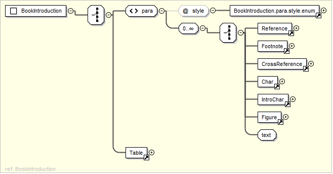
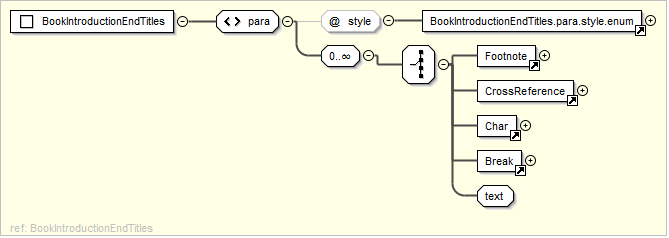
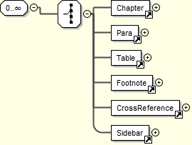

.. include:: /_static/inc_styles.txt

.. _usx_docStructure:

Document Structure
==================
A USX document consists of valid USX elements organized within the following sequence of document divisions.

* :ref:`Book Identification<usx-div_bookIdentification>`
* :ref:`Book Headers<usx-div_bookHeaders>`
* :ref:`Book Titles<usx-div_bookTitles>`
* :ref:`Book Introduction<usx-div_bookIntroduction>`
* :ref:`Book Introduction End Titles<usx-div_bookIntroductionEndTitles>`
* :ref:`Book Chapter Label<usx-div_bookChapterLabel>`
* :ref:`Chapter<usx-div_chapter>`

-----

.. index:: document structure; book identification
.. _usx-div_bookIdentification:

Book Identification
-------------------

.. image:: images/usx-div_BookIdentification.png

The :ref:`book <usx-element_book>` element for primary book identification.

-----

.. index:: document structure; book headers
.. _usx-div_bookHeaders:

Book Headers
------------

.. image:: images/usx-div_BookHeaders.png

An optional collection of one or more :ref:`para <usx-element_para>` elements for providing vernacular book name and abbreviation texts.

* Valid @style types (alphabetical): :ref:`h <usx-parastyle_h>`, ide, rem, :ref:`toc1 <usx-parastyle_toc1>`, :ref:`toc2 <usx-parastyle_toc2>`, :ref:`toc3 <usx-parastyle_toc3>`

-----

.. index:: document structure; book titles
.. _usx-div_bookTitles:

Book Titles
-----------

.. image:: images/usx-div_BookTitles.png

A collection of one or more :ref:`para <usx-element_para>` elements for book main titles.

* Valid @style types (alphabetical): :ref:`imt <usx-parastyle_imt>`, :ref:`imt1 <usx-parastyle_imt>`, :ref:`imt2 <usx-parastyle_imt>`, :ref:`mt <usx-parastyle_mt>`, :ref:`mt1 <usx-parastyle_mt>`, :ref:`mt2 <usx-parastyle_mt>`, :ref:`mt3 <usx-parastyle_mt>`, :ref:`mt4 <usx-parastyle_mt>`, rem
* Optional collection of one or more child elements (may be nested): :ref:`note <usx-element_note>` (@style f, fe, x), :ref:`char <usx-element_char>`, :ref:`optbreak <usx-element_optbreak>`

-----

.. index:: document structure; book introduction
.. _usx-div_bookIntroduction:

Book Introduction
-----------------

An optional collection of :ref:`para <usx-element_para>` or :ref:`table <usx-element_table>` elements for book introductions.

* Valid @style types (alphabetical): :ref:`ib <usx-parastyle_ib>`, :ref:`ie <usx-parastyle_ie>`, :ref:`iex <usx-parastyle_iex>`, :ref:`ili <usx-parastyle_ili>`, :ref:`ili1 <usx-parastyle_ili>`, :ref:`ili2 <usx-parastyle_ili>`, :ref:`im <usx-parastyle_im>`, :ref:`imi <usx-parastyle_im>`, :ref:`imq <usx-parastyle_imq>`, :ref:`imt <usx-parastyle_imt>`, :ref:`imt1 <usx-parastyle_imt>`, :ref:`imt2 <usx-parastyle_imt>`, :ref:`imt3 <usx-parastyle_imt>`, :ref:`imt4 <usx-parastyle_imt>`, :ref:`imte <usx-parastyle_imte>`, :ref:`imte1 <usx-parastyle_imte>`, :ref:`imte2 <usx-parastyle_imte>`, :ref:`io <usx-parastyle_io>`, :ref:`io1 <usx-parastyle_io>`, :ref:`io2 <usx-parastyle_io>`, :ref:`io3 <usx-parastyle_io>`, :ref:`io4 <usx-parastyle_io>`, :ref:`iot <usx-parastyle_iot>`, :ref:`ip <usx-parastyle_ip>`, :ref:`ipi <usx-parastyle_ipi>`, :ref:`ipq <usx-parastyle_ipq>`, :ref:`ipr <usx-parastyle_ipr>`, :ref:`iq <usx-parastyle_iq>`, :ref:`iq1 <usx-parastyle_iq>`, :ref:`iq2 <usx-parastyle_iq>`, :ref:`iq3 <usx-parastyle_iq>`, :ref:`is <usx-parastyle_is>`, :ref:`is1 <usx-parastyle_is>`, :ref:`is2 <usx-parastyle_is>`, rem
* Optional collection of one or more child elements: :ref:`note <usx-element_note>` (@style f, fe), :ref:`char <usx-element_char>`, :ref:`figure <usx-element_figure>`, :ref:`optbreak <usx-element_optbreak>`

-----

.. index:: document structure; book introduction end titles
.. _usx-div_bookIntroductionEndTitles:

Book Introduction End Titles
----------------------------

An optional collection of :ref:`para <usx-element_para>` elements for book titles occurring at the end of the book introduction.

* Valid @style types (alphabetical): :ref:`imt <usx-parastyle_imt>`, :ref:`imt1 <usx-parastyle_imt>`, :ref:`imt2 <usx-parastyle_imt>`, :ref:`mt <usx-parastyle_mt>`, :ref:`mt1 <usx-parastyle_mt>`, :ref:`mt2 <usx-parastyle_mt>`, :ref:`mt3 <usx-parastyle_mt>`, :ref:`mt4 <usx-parastyle_mt>`
* Optional collection of one or more child elements: :ref:`note <usx-element_note>` (@style f, fe), :ref:`char <usx-element_char>`, :ref:`figure <usx-element_para>`, :ref:`optbreak <usx-element_optbreak>`

-----

.. index:: document structure; book chapter label
.. _usx-div_bookChapterLabel:

Book Chapter Label
------------------

.. image:: images/usx-div_BookChapterLabel.png

An optional :ref:`para <usx-element_para>` element for a chapter heading text which could be applied (typically as a heading) to all chapters in the current book.

* Valid @style types: :ref:`cl <usx-parastyle_cl>`

-----

.. index:: document structure; chapter
.. _usx-div_chapter:

Chapter
-------

